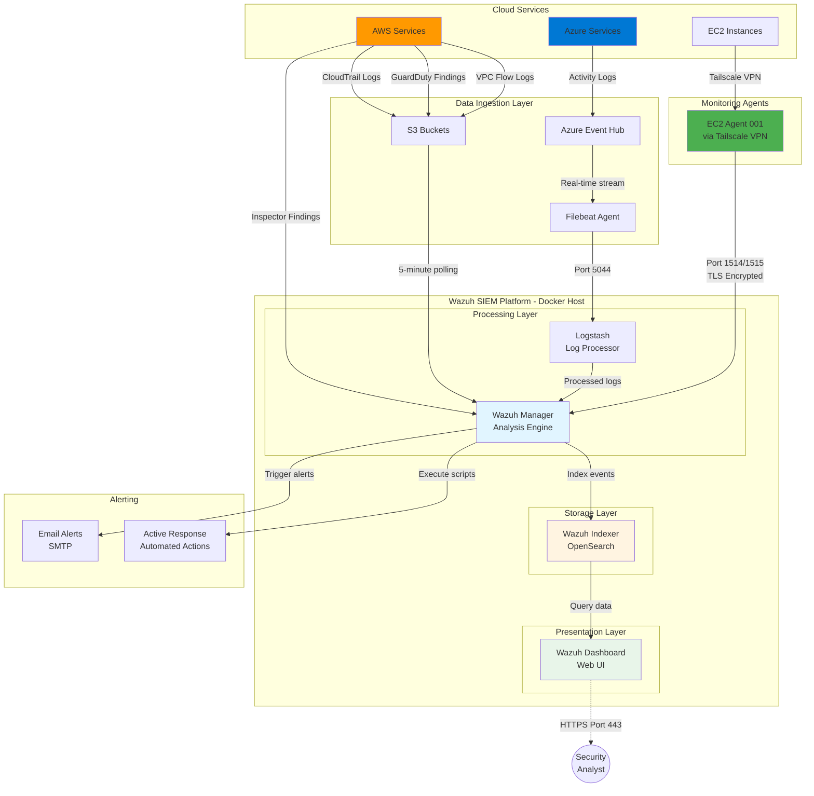
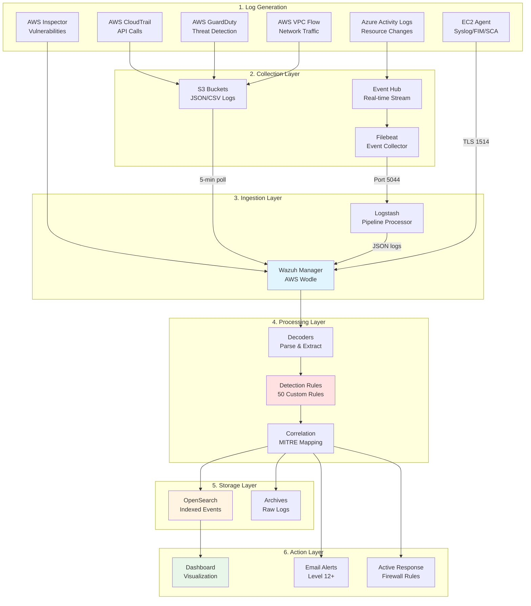
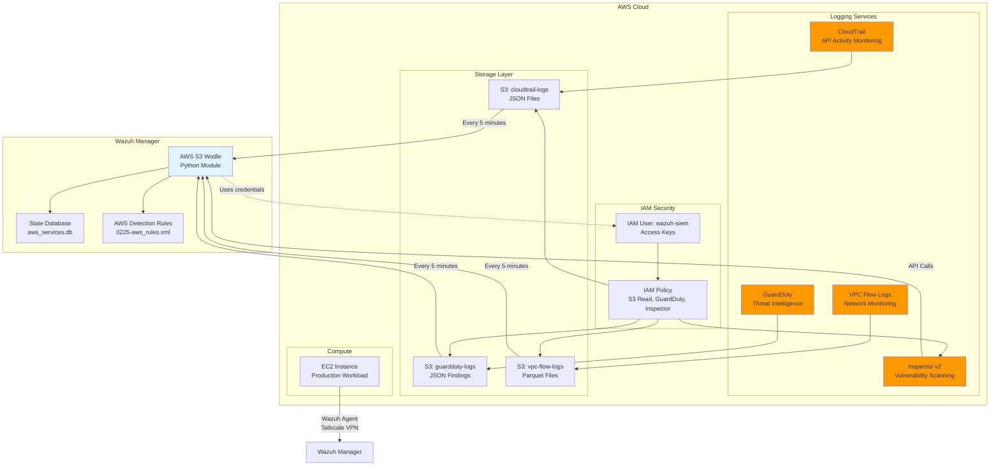
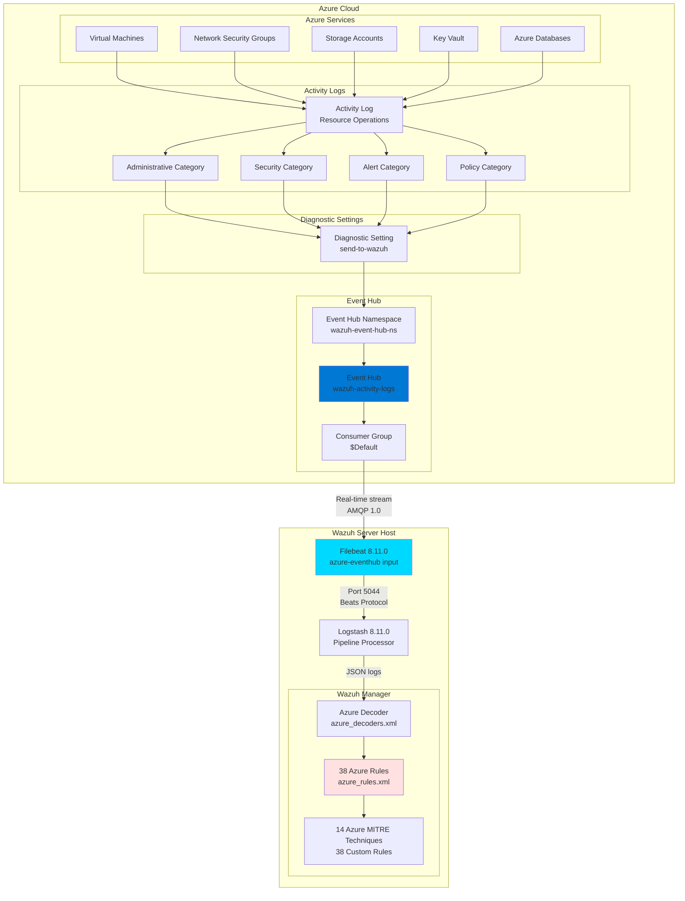
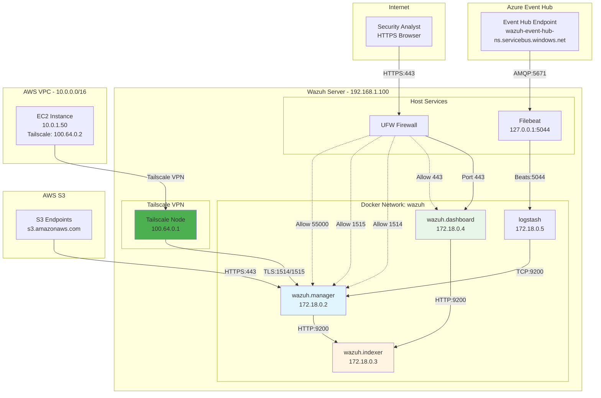
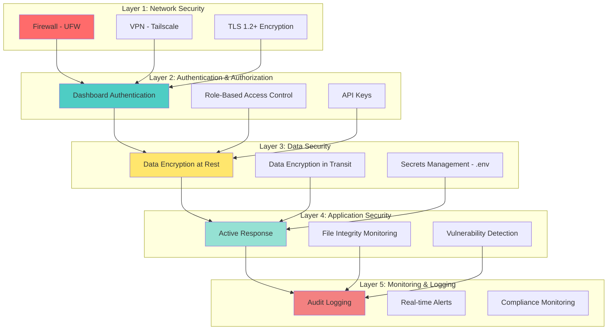

#  System Architecture

Comprehensive technical architecture documentation for the Multi-Cloud SIEM with Wazuh.


##  Table of Contents

1. [Overview](#overview)
2. [System Architecture](#system-architecture)
3. [Component Details](#component-details)
4. [Data Flow](#data-flow)
5. [AWS Integration Architecture](#aws-integration-architecture)
6. [Azure Integration Architecture](#azure-integration-architecture)
7. [Network Architecture](#network-architecture)
8. [Security Architecture](#security-architecture)
9. [Scalability & Performance](#scalability--performance)
10. [Disaster Recovery](#disaster-recovery)


##  Overview

### Architecture Highlights

- **Deployment Type**: Hybrid (On-premise manager with cloud workloads)
- **Platform**: Docker containerized Wazuh 4.13
- **Cloud Coverage**: AWS + Azure multi-cloud
- **Agent Support**: EC2 endpoints via Tailscale VPN
- **Log Processing**: 370+ events/day with real-time analysis
- **Storage**: OpenSearch/Elasticsearch for event indexing
- **Detection**: 50 custom rules with MITRE ATT&CK mapping

### Design Principles

1. **Cost Efficiency**: Open-source stack with 99% cost savings vs commercial SIEM
2. **Scalability**: Containerized architecture for easy horizontal scaling
3. **Security**: Encrypted communications, TLS/SSL, VPN for agent connectivity
4. **Compliance**: PCI DSS, HIPAA, ISO 27001, NIST 800-53, GDPR, SOC 2 coverage
5. **Maintainability**: Infrastructure-as-Code, version controlled configurations
6. **Observability**: Centralized logging, real-time dashboards, email alerting


##  System Architecture

### High-Level Architecture



### Architecture Layers

| Layer | Components | Purpose |
|-------|-----------|---------|
| **Cloud Sources** | AWS Services, Azure Services | Generate security events and logs |
| **Data Ingestion** | S3 buckets, Event Hub, Filebeat | Collect and forward logs |
| **Processing** | Wazuh Manager, Logstash | Decode, analyze, correlate events |
| **Storage** | OpenSearch/Elasticsearch | Index and store security events |
| **Presentation** | Wazuh Dashboard | Visualize alerts and analytics |
| **Endpoints** | Wazuh Agents | Monitor EC2 instances |
| **Response** | Email alerts, Active Response | Notify and automate actions |


##  Component Details

### Wazuh Manager

**Role**: Core analysis engine and rule processor

**Specifications:**
- **Container**: `wazuh/wazuh:4.13.0`
- **CPU**: 2-4 cores
- **Memory**: 4GB allocated
- **Ports**: 1514 (agent data), 1515 (enrollment), 55000 (API)

**Key Features:**
- Log decoding and parsing (3000+ decoders)
- Rule-based detection (50 custom rules)
- MITRE ATT&CK framework mapping
- AWS cloud integration (S3 wodle)
- Azure log processing (via Logstash)
- Active Response automation
- Email alerting
- Agent management
- CIS benchmark scanning
- File integrity monitoring
- Vulnerability detection

### Wazuh Indexer (OpenSearch)

**Role**: Event storage and search engine

**Specifications:**
- **Container**: `wazuh/wazuh-indexer:4.13.0`
- **CPU**: 2-4 cores
- **Memory**: 4-8GB (configurable)
- **Port**: 9200 (internal API)

**Key Features:**
- RESTful API for queries
- Full-text search
- Aggregations and analytics
- Index lifecycle management
- TLS encryption
- Role-based access control (RBAC)

### Wazuh Dashboard

**Role**: Web-based visualization and management interface

**Specifications:**
- **Container**: `wazuh/wazuh-dashboard:4.13.0`
- **CPU**: 1-2 cores
- **Memory**: 2GB
- **Port**: 443 (HTTPS)

**Key Features:**
- Security events dashboard
- MITRE ATT&CK visualization
- Agent management interface
- File integrity monitoring views
- Vulnerability reports
- Compliance dashboards
- Custom visualizations


##  Data Flow

### Complete Log Processing Pipeline




##  AWS Integration Architecture

### AWS Services Topology




##  Azure Integration Architecture

### Azure Services Topology




##  Network Architecture

### Network Topology



### Port Matrix

| Service | Port | Protocol | Direction | Purpose |
|---------|------|----------|-----------|---------|
| **Wazuh Dashboard** | 443 | TCP (HTTPS) | Inbound | Web UI access |
| **Wazuh Manager** | 1514 | TCP (TLS) | Inbound | Agent data |
| **Wazuh Manager** | 1515 | TCP | Inbound | Agent enrollment |
| **Wazuh Manager** | 55000 | TCP (HTTPS) | Inbound | API access |
| **Wazuh Indexer** | 9200 | TCP (HTTP) | Internal | REST API |
| **Logstash** | 5044 | TCP | Inbound | Filebeat input |
| **Filebeat** | 5671 | TCP (AMQP) | Outbound | Azure Event Hub |
| **Tailscale** | 41641 | UDP | Bidirectional | VPN mesh network |


##  Security Architecture

### Security Layers




##  Scalability & Performance

### Current Capacity

**Throughput:**
- Events per second (EPS): 50-100
- Daily events: 370+ (current baseline)
- Peak EPS: 500+ (tested with load)

**Storage:**
- Active indices: 7 days × 1GB/day = 7GB
- Total capacity: 100GB SSD
- Retention: 30 days before archive

**Processing:**
- Average decode time: <10ms
- Rule evaluation: <5ms
- End-to-end latency: <100ms


##  Disaster Recovery

### Backup Strategy

**What's Backed Up:**
1. Docker volumes (15 volumes)
2. Host configurations
3. Custom rules and decoders
4. SSL certificates
5. Environment variables (.env)

**Backup Schedule:**
```cron
# Daily at 2 AM
0 2 * * * /path/to/wazuh-backup-complete-v2.sh

# Weekly cleanup (keep last 7 backups)
0 3 * * 0 find /var/backups/wazuh -mtime +7 -delete
```

**Recovery Time Objective (RTO):** 1 hour  
**Recovery Point Objective (RPO):** 24 hours


##  References

### Official Documentation
- [Wazuh Documentation](https://documentation.wazuh.com/)
- [OpenSearch Documentation](https://opensearch.org/docs/)
- [Docker Documentation](https://docs.docker.com/)

### Architecture Resources
- [MITRE ATT&CK Framework](https://attack.mitre.org/)
- [AWS Well-Architected Framework](https://aws.amazon.com/architecture/well-architected/)
- [Azure Architecture Center](https://learn.microsoft.com/en-us/azure/architecture/)


**Architecture Version:** 1.0  
**Last Updated:** November 20, 2025  
**Maintained By:** Ghulam Dastagir

Return to [README](README.md) | View [SETUP Guide](SETUP.md)
