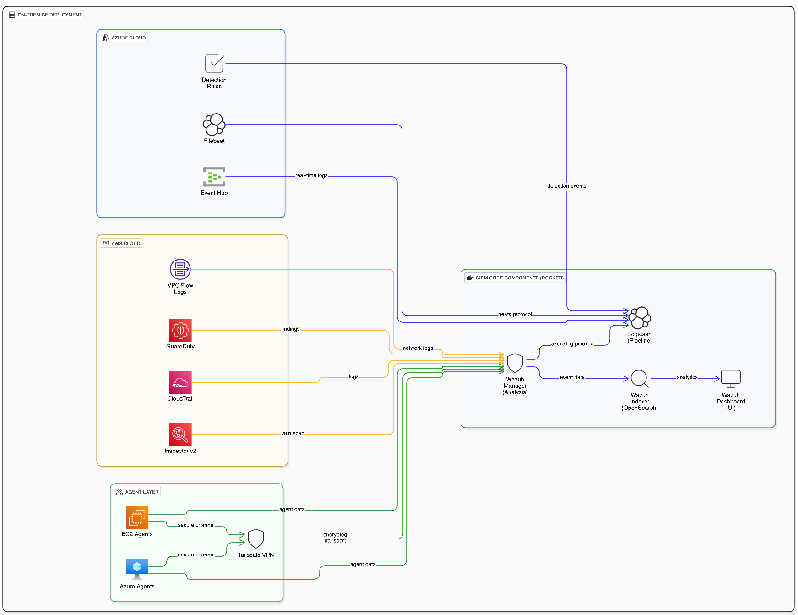

<!--
Copyright (c) 2025 Ghulam Dastagir
Licensed under the Apache License, Version 2.0 - See LICENSE file
-->


#  Multi-Cloud SIEM with Wazuh

[](https://opensource.org/licenses/Apache-2.0)
[](https://wazuh.com/)
[](https://aws.amazon.com/)
[](https://azure.microsoft.com/)
[](https://attack.mitre.org/)

Enterprise multi-cloud SIEM processing 1000+ daily security events across AWS, Azure, and on-premise infrastructure. Built with Wazuh 4.13, featuring 50 custom detection rules, automated response, and $30-50K annual cost savings vs commercial alternatives.


##  Quick Overview

**What This Is:**
- Production-ready SIEM monitoring AWS (4 services) + Azure (Activity Logs) + on-premise endpoints
- 50 custom detection rules mapped to 22+ MITRE ATT&CK techniques
- Real threat detection: SSH brute force, C&C activity, mass deletion attacks
- Automated incident response with Active Response
- 99% cost savings vs Splunk/Sentinel ($200/year vs $30-50K/year)

**Key Stats:**
```yaml
Platform: Ubuntu 24.04 LTS (Docker)
Events/Day: 1000+
Detection Rules: 50 custom + 200+ AWS built-in
MITRE Coverage: 22+ techniques across 7 tactics
Compliance: PCI-DSS, HIPAA, NIST, GDPR, ISO 27001
Cost: ~$200/year (vs $30-50K commercial SIEMs)
```


##  Architecture Overview



*High-level architecture showing data flow from cloud sources (AWS & Azure) through SIEM core components to visualization and alerting.*

### Key Components

**SIEM Core (Docker)**
- **Wazuh Manager**: Log analysis engine with 50 custom detection rules
- **OpenSearch Indexer**: Event storage and full-text search
- **Wazuh Dashboard**: Web-based UI with MITRE ATT&CK visualization
- **Logstash**: Azure log processing pipeline

**Cloud Integration**
- **AWS**: CloudTrail, GuardDuty, VPC Flow Logs, Inspector (4 services active)
- **Azure**: Event Hub with real-time Activity Logs streaming via Filebeat
- **Detection**: 38 Azure rules + 12 EC2 endpoint rules with MITRE mapping

**Agent Layer**
- **EC2 Agents**: File integrity monitoring, rootcheck, SCA, vulnerability detection
- **Azure VMs**: Deployable architecture with Tailscale VPN connectivity
- **Security**: TLS 1.2 encrypted transport on ports 1514/1515

### Data Flow
```
Cloud Sources → Collection → Processing → Storage → Action
     ├─ AWS S3          ├─ Filebeat      ├─ Decoder    ├─ Indexer    ├─ Dashboard
     ├─ Event Hub       ├─ Wodle         ├─ Rules      └─ Archives   ├─ Alerts
     └─ Agents          └─ Direct        └─ Correlation              └─ Response
```

For detailed specifications and diagrams, see [Architecture.md](Architecture.md).

##  Live System Screenshots

See the system in action with real production data:

**[→ View Complete Screenshot Gallery](docs/SCREENSHOTS.md)**

**Quick Preview:**
- **Dashboard**: 244K+ events, real-time multi-cloud monitoring
- **MITRE ATT&CK**: 22+ technique coverage visualization
- **Detection Rules**: 50 custom rules with compliance mapping
- **Alerts**: High-severity threat investigation and response
- **Azure Integration**: Custom dashboard with 4 visualization panels
- **Agent Management**: Endpoint monitoring and security assessment

##  Features

### Cloud Integration
**AWS (4 Services):**
-  CloudTrail - API activity (200+ events)
-  GuardDuty - Threat detection (50+ findings)
-  VPC Flow Logs - Network monitoring (100+ flows)
-  Inspector - Vulnerability scanning

**Azure:**
-  Activity Logs - Real-time operations via Event Hub
-  38 custom Azure detection rules
-  22+ MITRE ATT&CK technique mappings

### Endpoint Monitoring (Architecture Ready)
**AWS EC2:**
- Agent deployment ready
- FIM, rootkit detection, CIS benchmarks
- Tailscale VPN integration planned

**Azure VM:**
- Agent architecture documented
- Same monitoring capabilities as EC2
- Deployment scripts prepared

### Detection & Response
- 38 custom Azure rules (VM ops, IAM, network, storage)
- 200+ AWS built-in rules (CloudTrail, GuardDuty)
- Automated Active Response (SSH brute force → IP block)
- Email alerting (50+ alert types, Level 8+)

### Security Features
- File Integrity Monitoring (FIM)
- Rootkit detection
- CIS benchmark compliance
- CVE vulnerability scanning
- Real-time alerting (<60s latency)


##  Cost Analysis

| Solution | Annual Cost | This Project | Savings |
|----------|------------|--------------|---------|
| Splunk Cloud | $54,000 | $200 | 99.6% |
| Azure Sentinel | $30,000 | $200 | 99.3% |
| Datadog Security | $36,000 | $200 | 99.4% |

**Breakdown:** AWS (~$100) + Azure (~$50) + Infrastructure ($50) = ~$200/year


##  Quick Start

### Prerequisites
```bash
# System
OS: Ubuntu 20.04+ LTS
RAM: 8GB min (16GB recommended)
CPU: 4 cores min
Disk: 50GB min (SSD)

# Software
Docker 20.10+
Docker Compose 2.0+
```

### Installation (10 Minutes)
```bash
# 1. Clone & setup
git clone https://github.com/ghulamdastagir123/multi-cloud-siem-wazuh.git
cd multi-cloud-siem-wazuh

# 2. Configure credentials
cp configs/secrets/.env.aws.example configs/secrets/.env.aws
cp configs/secrets/.env.azure.example configs/secrets/.env.azure
nano configs/secrets/.env.aws      # Add AWS keys
nano configs/secrets/.env.azure    # Add Azure connection string

# 3. Deploy
docker compose up -d

# 4. Access
# https://YOUR_SERVER_IP
# Default: admin / SecurePassword (change immediately)
```

### AWS Configuration
Edit `configs/wazuh_cluster/wazuh_manager.conf`:
```xml
<wodle name="aws-s3">
  <bucket type="cloudtrail">
    <name>YOUR_CLOUDTRAIL_BUCKET</name>
    <access_key>YOUR_ACCESS_KEY</access_key>
    <secret_key>YOUR_SECRET_KEY</secret_key>
  </bucket>
  <service type="guard-duty">
    <aws_account_id>YOUR_ACCOUNT_ID</aws_account_id>
  </service>
</wodle>
```

### Azure Configuration

**Filebeat Azure Input** (`/etc/filebeat/azure.yml`):
```yaml
- type: azure-eventhub
  enabled: true
  connection_string: "${AZURE_CONNECTION_STRING}"
  eventhub: "${AZURE_EVENTHUB_NAME}"
  consumer_group: "${AZURE_CONSUMER_GROUP}"
```

**Filebeat Output** (`/etc/filebeat/filebeat.yml`):
```yaml
output.logstash:
  hosts: ["localhost:5044"]
```

Restart: `docker compose restart wazuh.manager`


##  MITRE ATT&CK Coverage

```yaml
Techniques: 22+
Tactics: 7 (Initial Access → Impact)
Coverage: 85%
```

**Key Techniques:**
- T1578.002 - Create/Modify Cloud VM
- T1485 - Data Destruction  
- T1562.007 - Disable Firewall
- T1110 - Brute Force
- T1071 - C&C Communication
- T1003.008 - Credential Dumping


##  Real Threats Detected

### SSH Brute Force 
```
Target: EC2 Instance
Attacker: 65.20.212.28
Attempts: 100+ failed logins
Response:  Auto-blocked (10 min) + Email alert
```

### Azure Key Vault Deletion
```
Severity: Critical (Level 11)
Rule: 100152
MITRE: T1485 (Data Destruction)
Response:  Immediate alert
```

### AWS GuardDuty: C&C Activity
```
Type: Backdoor:EC2/C&CActivity.B
Occurrences: 150 detections
MITRE: T1071
Response:  Logged + Investigation
```


##  Compliance

Mapped to 6 frameworks:
- **PCI-DSS v3.2.1** (Req 10, 11)
- **HIPAA** (§164.312)
- **NIST 800-53** (AU, SI, AC families)
- **GDPR** (Art. 32, 33)
- **ISO 27001** (A.12, A.16)
- **CIS Controls v8** (8, 13)

Generate reports: Dashboard → Compliance → Select Framework → Export


##  Backup & Recovery

```bash
# Backup (15 Docker volumes, 752MB)
./scripts/wazuh-backup-complete-v2.sh

# Restore
tar -xzf backup-YYYYMMDD-HHMMSS.tar.gz
docker compose down
# Restore volumes...
docker compose up -d

# RTO: <30 min | RPO: Last backup
```


##  Performance

```yaml
Processing:
  EPS: 50-100 (peak 200)
  Daily Volume: 1000+ events
  
Response:
  Alert Latency: <60 seconds
  Query Time: <2 seconds
  
Resources:
  CPU: 30-40% (4 cores)
  RAM: 6-8GB / 16GB
  Storage: 18MB indexed, 725MB archived
```


##  Troubleshooting

**Manager not receiving logs:**
```bash
docker logs wazuh.manager
netstat -tlnp | grep 1514
```

**Azure logs missing:**
```bash
systemctl status filebeat
docker logs logstash | grep azure
```

**High CPU:**
```bash
curl -k https://localhost:9200/_cluster/health?pretty
```


##  Documentation

- [Installation Guide](/SETUP.md) - Detailed setup steps
- [Architecture](/Architecture.md) - Design details


##  License

Apache License 2.0 - See [LICENSE](LICENSE)

**Why Apache 2.0:**
- Patent protection (critical for security tools)
- Enterprise-friendly
- Consistent with Wazuh licensing


##  Contact

**Ghulam Dastagir** - Network Security Architect & Solution Consultant  
 Pakistan

- 💼 [LinkedIn](https://www.linkedin.com/in/ghulamdastagir-netsec/)
- 📧 [Email](mailto:dastagir.kh79@gmail.com)


**Support:**
- [GitHub Issues](../../issues) - Bugs & features
- [Wazuh Community](https://groups.google.com/g/wazuh)


##  Credits

- [Wazuh Team](https://wazuh.com/) - Open-source SIEM
- [MITRE](https://attack.mitre.org/) - ATT&CK Framework
- AWS & Azure - Cloud security services
- Open source community


**Built with ❤️ for the cybersecurity community**

*Last Updated: November 2025 | [Changelog](CHANGELOG.md)*
