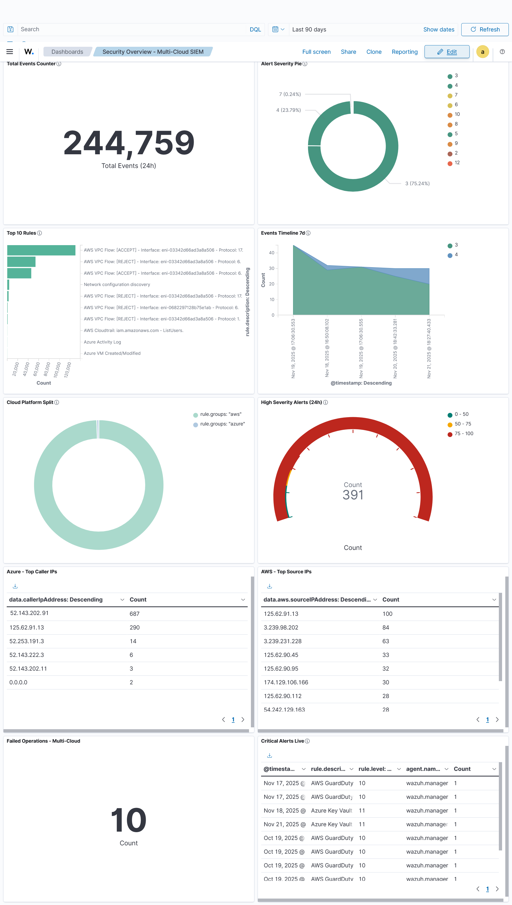
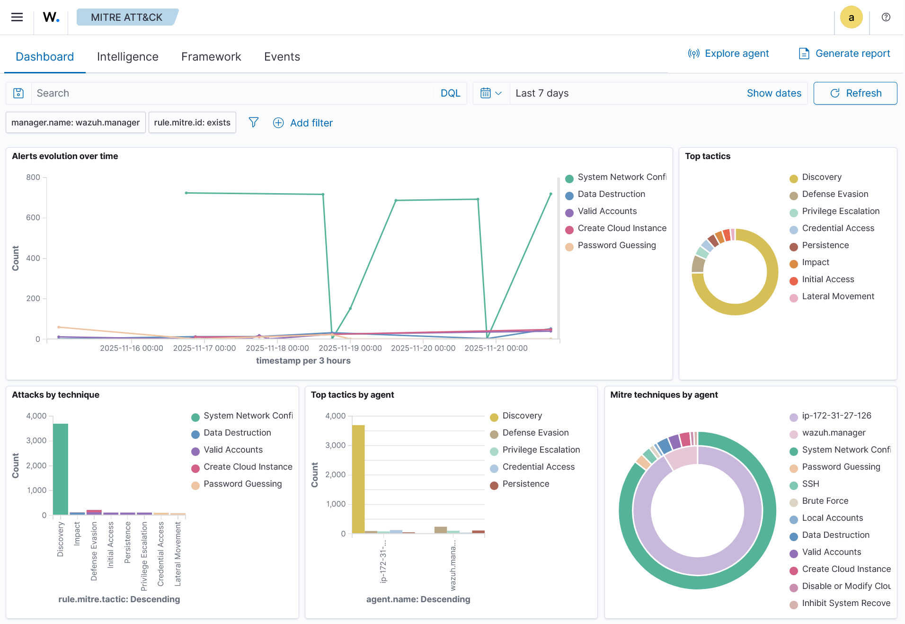
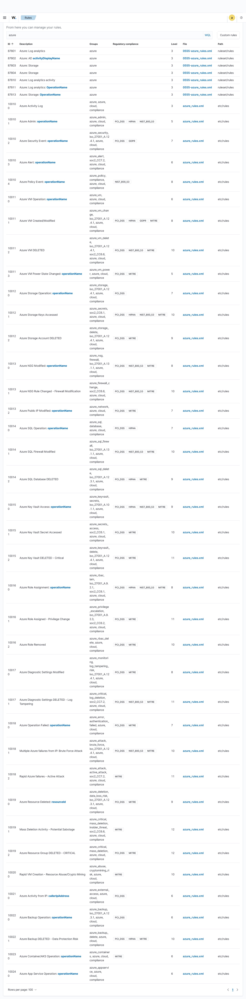
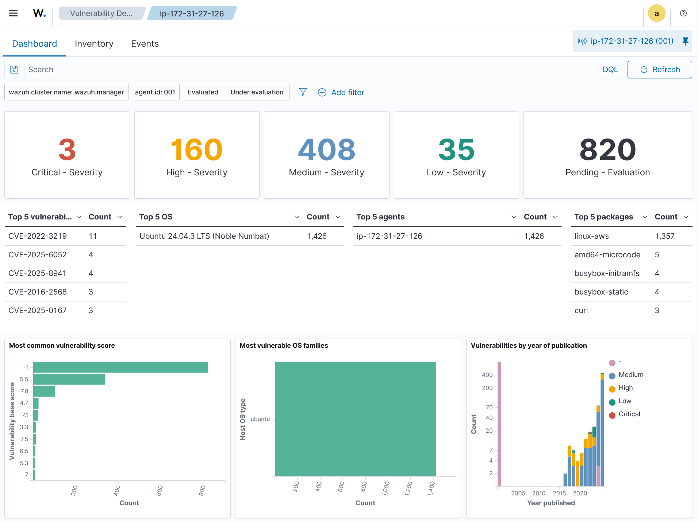
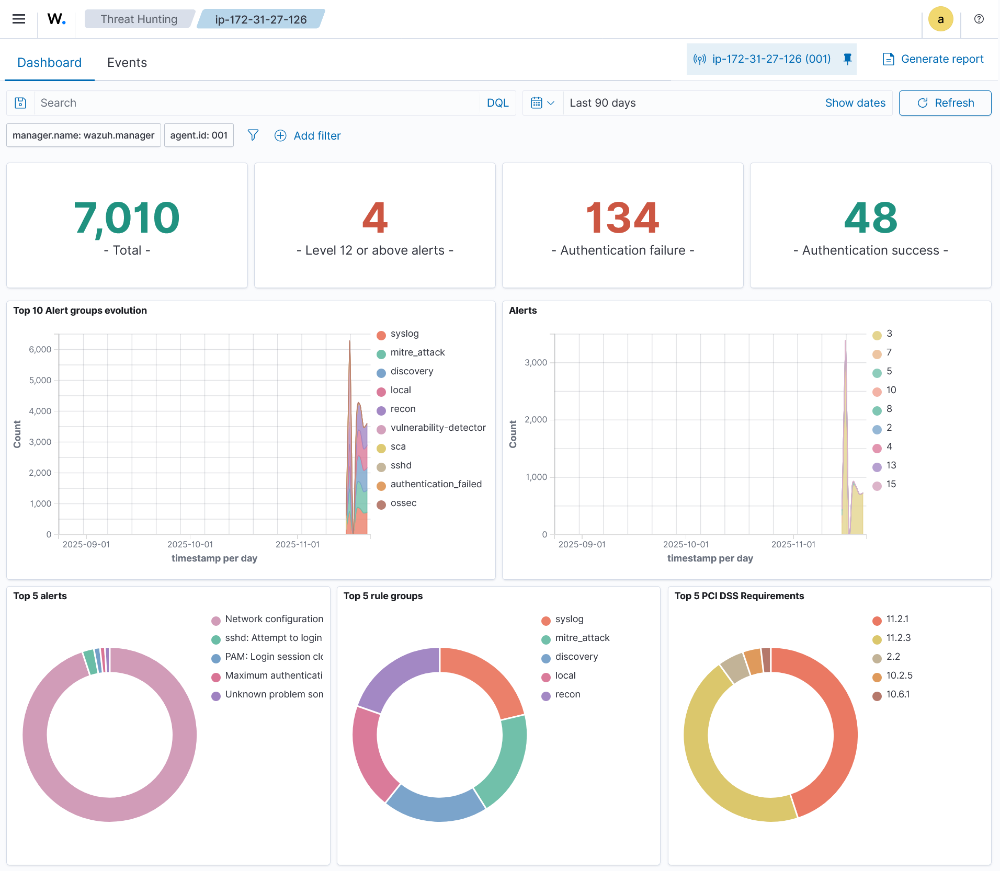
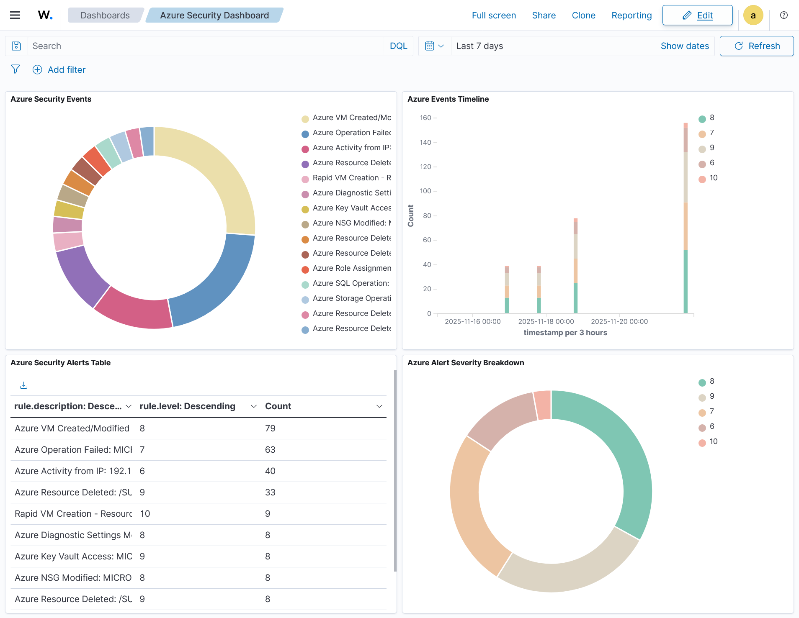

#  System Screenshots

Visual demonstration of the Multi-Cloud SIEM in production.

---

## 1. Dashboard Overview

**Main security events dashboard** showing real-time monitoring across AWS, Azure, and agent endpoints.

**Key Metrics:**
- 244,759 total events (24 hours)
- 391 high-severity alerts
- Multi-cloud integration visible (AWS + Azure)
- Real-time event processing

---

## 2. MITRE ATT&CK Framework

**MITRE ATT&CK framework visualization** showing technique coverage across multiple tactics.

**Coverage:**
- 22+ unique techniques mapped
- 8 tactics covered (Initial Access → Impact)
- Color-coded threat matrix
- Custom rule integration

---

## 3. Detection Rules

**Custom detection rules** with MITRE ATT&CK technique mapping and compliance framework tags.

**Features:**
- 50 custom detection rules
- 38 Azure Activity Log rules
- 12 EC2 endpoint rules
- MITRE technique mapping
- PCI DSS, HIPAA, ISO 27001 compliance tags

---

## 4. Agent Status

**Agent connectivity status** showing endpoint monitoring capabilities.

**Capabilities:**
- Real-time agent monitoring
- File Integrity Monitoring (FIM)
- Rootkit detection
- Security Configuration Assessment (SCA)
- Vulnerability detection

---

## 5. Alert Details

**High-severity alert** with full event context, MITRE mapping, and actionable intelligence.

**Details:**
- Alert severity and classification
- MITRE ATT&CK technique identification
- Complete event data (JSON)
- Source information and context
- Investigation timeline

---

## 6. Azure Security Dashboard

**Custom Azure security dashboard** with multi-panel visualization of Activity Log events.

**Panels:**
- Event distribution by severity
- Timeline analysis
- Operations table
- Top callers and source IPs
- Real-time Azure resource monitoring

---

##  Summary

**System Status:**  Production Ready  
**Screenshot Date:** November 2025  
**Event Volume:** 1000+ daily events  
**Detection Coverage:** 50 custom rules with MITRE mapping  

For technical details, see [Architecture Documentation](../Architecture.md).

---

**[← Back to README](../README.md)** | **[Setup Guide →](../SETUP.md)**
